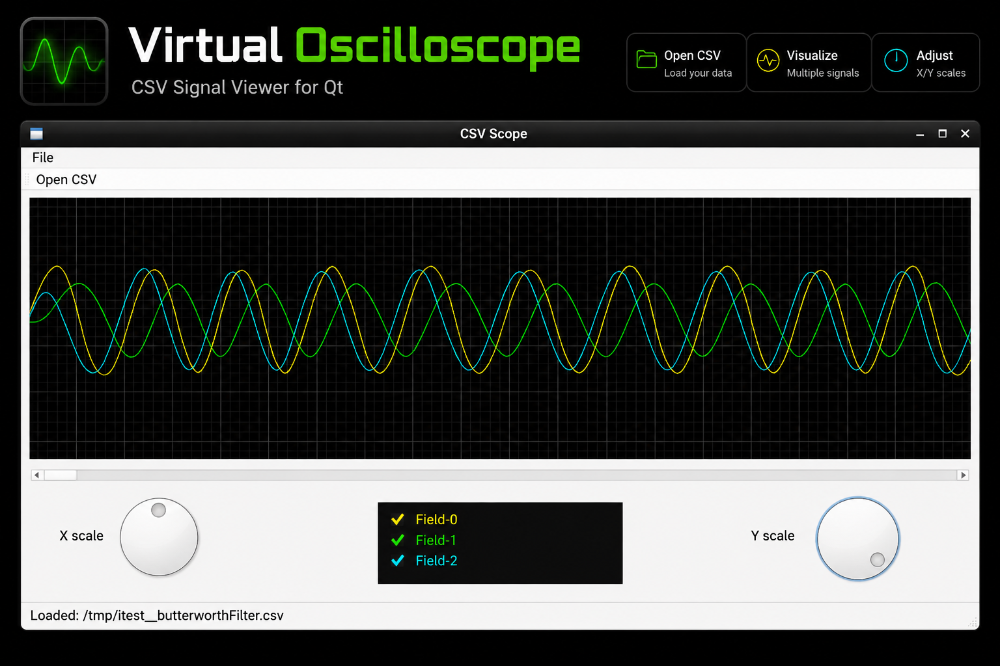

## 1.0 Files

| Files/Dirs   | Description                           |
|--------------|---------------------------------------|
| images       | Pictures for RADME.md file            |
| INSTALL.sh   | BASH script for software installation |
| lgpl-3.0.txt | Project's licence                     |
| src          | Project's source code                 |

## 2.0 Decription
Virtual Oscilloscope is a lightweight Qt-based application for visualizing signals stored in CSV files. It provides an
oscilloscope-like interface with adjustable X/Y scaling, multi-channel display, and interactive signal inspection, making it
useful for embedded development, data analysis, and filter debugging.

### 2.1 Build the source code
In order to build the software you need the standard QT libraries and the Qmake (ver 6) building tool. For the next step
enter in the <project>/src sub folder and type the following command:
	
	qmake6 && make

If you want to install just the binary, you can use the following command

	[PREFIX=<folder>] make install

## 3.0 How to install virtualOscilloscope software
In order to avoid to create the common INSTALL script to install and remove minute software, I have created the winstall
sub-module. It allows you to install and remove the package in easy way. The **winstall.sh** file should be located in the
toows/winstall folder. If the folder is missing, then you have to clone the sub-module with the following command:

	git submodule update --init --recursive

When you bave downloaded the sub-module, you can install mionute with the following command:

	sudo ./tools/winstall/winstall.sh --cmd=install --verbose

For further information on this tool, please, read the [winstall project's page](https://github.com/catinella/winstall)

## 4.0 Licence:
This project is a free software; you can redistribute it and/or modify it under the terms	of the GNU Lesser General Public License
as published by the Free Software Foundation; either version 3.0 of the License, or (at your option) any later version. 

For further details please read the full [LGPL text file](https://www.gnu.org/licenses/lgpl-3.0.txt).
You should find a copy of the GNU General Public License document in the root folder of the project; if not, write to the 

	Free Software Foundation, Inc.,
	59 Temple Place, Suite 330,
	Boston, MA  02111-1307  USA
